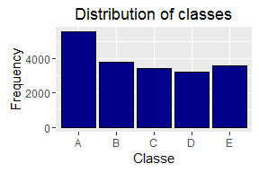

# Final Assignment
Desiré De Waele  
16 juli 2016  

# Background

Using devices such as Jawbone Up, Nike FuelBand, and Fitbit it is now possible to collect a large amount of data about personal activity relatively inexpensively. These type of devices are part of the quantified self movement - a group of enthusiasts who take measurements about themselves regularly to improve their health, to find patterns in their behavior, or because they are tech geeks. One thing that people regularly do is quantify how much of a particular activity they do, but they rarely quantify how well they do it. In this project, your goal will be to use data from accelerometers on the belt, forearm, arm, and dumbell of 6 participants. They were asked to perform barbell lifts correctly and incorrectly in 5 different ways. More information is available from the website here: http://groupware.les.inf.puc-rio.br/har (see the section on the Weight Lifting Exercise Dataset).

# Data manipulation
## Obtaining Data
The training data for this project are available here: https://d396qusza40orc.cloudfront.net/predmachlearn/pml-training.csv

The test data are available here: https://d396qusza40orc.cloudfront.net/predmachlearn/pml-testing.csv


```r
# Set csv files in same directory as working directory
train_data <- read.csv("pml-training.csv", header=T, na.strings=c("NA", "#DIV/0!"))
test_data <- read.csv("pml-testing.csv", header=T, na.string=c("NA", "#DIV/0!"))
data.frame(dim(train_data), dim(test_data))
```

```
##   dim.train_data. dim.test_data.
## 1           19622             20
## 2             160            160
```
## Data Exploration
Apparently we have 160 variables. There are 19622 and 20 observations in our training and test data respectivily. The goal of this project is to predict the manner in which they did the exercise. This is the "classe" variable in the training set, the last column. Let's have a look at the training data. 

```r
library(plyr); library(dplyr)
tbl_df(train_data)
```

```
## Source: local data frame [19,622 x 160]
## 
##        X user_name raw_timestamp_part_1 raw_timestamp_part_2
##    (int)    (fctr)                (int)                (int)
## 1      1  carlitos           1323084231               788290
## 2      2  carlitos           1323084231               808298
## 3      3  carlitos           1323084231               820366
## 4      4  carlitos           1323084232               120339
## 5      5  carlitos           1323084232               196328
## 6      6  carlitos           1323084232               304277
## 7      7  carlitos           1323084232               368296
## 8      8  carlitos           1323084232               440390
## 9      9  carlitos           1323084232               484323
## 10    10  carlitos           1323084232               484434
## ..   ...       ...                  ...                  ...
## Variables not shown: cvtd_timestamp (fctr), new_window (fctr), num_window
##   (int), roll_belt (dbl), pitch_belt (dbl), yaw_belt (dbl),
##   total_accel_belt (int), kurtosis_roll_belt (dbl), kurtosis_picth_belt
##   (dbl), kurtosis_yaw_belt (lgl), skewness_roll_belt (dbl),
##   skewness_roll_belt.1 (dbl), skewness_yaw_belt (lgl), max_roll_belt
##   (dbl), max_picth_belt (int), max_yaw_belt (dbl), min_roll_belt (dbl),
##   min_pitch_belt (int), min_yaw_belt (dbl), amplitude_roll_belt (dbl),
##   amplitude_pitch_belt (int), amplitude_yaw_belt (dbl),
##   var_total_accel_belt (dbl), avg_roll_belt (dbl), stddev_roll_belt (dbl),
##   var_roll_belt (dbl), avg_pitch_belt (dbl), stddev_pitch_belt (dbl),
##   var_pitch_belt (dbl), avg_yaw_belt (dbl), stddev_yaw_belt (dbl),
##   var_yaw_belt (dbl), gyros_belt_x (dbl), gyros_belt_y (dbl), gyros_belt_z
##   (dbl), accel_belt_x (int), accel_belt_y (int), accel_belt_z (int),
##   magnet_belt_x (int), magnet_belt_y (int), magnet_belt_z (int), roll_arm
##   (dbl), pitch_arm (dbl), yaw_arm (dbl), total_accel_arm (int),
##   var_accel_arm (dbl), avg_roll_arm (dbl), stddev_roll_arm (dbl),
##   var_roll_arm (dbl), avg_pitch_arm (dbl), stddev_pitch_arm (dbl),
##   var_pitch_arm (dbl), avg_yaw_arm (dbl), stddev_yaw_arm (dbl),
##   var_yaw_arm (dbl), gyros_arm_x (dbl), gyros_arm_y (dbl), gyros_arm_z
##   (dbl), accel_arm_x (int), accel_arm_y (int), accel_arm_z (int),
##   magnet_arm_x (int), magnet_arm_y (int), magnet_arm_z (int),
##   kurtosis_roll_arm (dbl), kurtosis_picth_arm (dbl), kurtosis_yaw_arm
##   (dbl), skewness_roll_arm (dbl), skewness_pitch_arm (dbl),
##   skewness_yaw_arm (dbl), max_roll_arm (dbl), max_picth_arm (dbl),
##   max_yaw_arm (int), min_roll_arm (dbl), min_pitch_arm (dbl), min_yaw_arm
##   (int), amplitude_roll_arm (dbl), amplitude_pitch_arm (dbl),
##   amplitude_yaw_arm (int), roll_dumbbell (dbl), pitch_dumbbell (dbl),
##   yaw_dumbbell (dbl), kurtosis_roll_dumbbell (dbl),
##   kurtosis_picth_dumbbell (dbl), kurtosis_yaw_dumbbell (lgl),
##   skewness_roll_dumbbell (dbl), skewness_pitch_dumbbell (dbl),
##   skewness_yaw_dumbbell (lgl), max_roll_dumbbell (dbl), max_picth_dumbbell
##   (dbl), max_yaw_dumbbell (dbl), min_roll_dumbbell (dbl),
##   min_pitch_dumbbell (dbl), min_yaw_dumbbell (dbl),
##   amplitude_roll_dumbbell (dbl), amplitude_pitch_dumbbell (dbl),
##   amplitude_yaw_dumbbell (dbl), total_accel_dumbbell (int),
##   var_accel_dumbbell (dbl), avg_roll_dumbbell (dbl), stddev_roll_dumbbell
##   (dbl), var_roll_dumbbell (dbl), avg_pitch_dumbbell (dbl),
##   stddev_pitch_dumbbell (dbl), var_pitch_dumbbell (dbl), avg_yaw_dumbbell
##   (dbl), stddev_yaw_dumbbell (dbl), var_yaw_dumbbell (dbl),
##   gyros_dumbbell_x (dbl), gyros_dumbbell_y (dbl), gyros_dumbbell_z (dbl),
##   accel_dumbbell_x (int), accel_dumbbell_y (int), accel_dumbbell_z (int),
##   magnet_dumbbell_x (int), magnet_dumbbell_y (int), magnet_dumbbell_z
##   (dbl), roll_forearm (dbl), pitch_forearm (dbl), yaw_forearm (dbl),
##   kurtosis_roll_forearm (dbl), kurtosis_picth_forearm (dbl),
##   kurtosis_yaw_forearm (lgl), skewness_roll_forearm (dbl),
##   skewness_pitch_forearm (dbl), skewness_yaw_forearm (lgl),
##   max_roll_forearm (dbl), max_picth_forearm (dbl), max_yaw_forearm (dbl),
##   min_roll_forearm (dbl), min_pitch_forearm (dbl), min_yaw_forearm (dbl),
##   amplitude_roll_forearm (dbl), amplitude_pitch_forearm (dbl),
##   amplitude_yaw_forearm (dbl), total_accel_forearm (int),
##   var_accel_forearm (dbl), avg_roll_forearm (dbl), stddev_roll_forearm
##   (dbl), var_roll_forearm (dbl), avg_pitch_forearm (dbl),
##   stddev_pitch_forearm (dbl), var_pitch_forearm (dbl), avg_yaw_forearm
##   (dbl), stddev_yaw_forearm (dbl), var_yaw_forearm (dbl), gyros_forearm_x
##   (dbl), gyros_forearm_y (dbl), gyros_forearm_z (dbl), accel_forearm_x
##   (int), accel_forearm_y (int), accel_forearm_z (int), magnet_forearm_x
##   (int), magnet_forearm_y (dbl), magnet_forearm_z (dbl), classe (fctr)
```

Let us have a look at the possible targets. There are five possible classes.

```r
levels(train_data$classe)
```

```
## [1] "A" "B" "C" "D" "E"
```



## Cleaning Data
We would like to have no missing values in our data and filter out the relevant columns. We do so with the the following commands. Note that we select the same variables for our test set as for our training set, except for our target.

```r
train_data <- train_data[, apply(train_data, 2, function(x) !any(is.na(x)))] 
train_data <- train_data[,-c(1:7)]
test_data <- test_data[,names(train_data[,-53])]

tbl_df(train_data)
```

```
## Source: local data frame [19,622 x 53]
## 
##    roll_belt pitch_belt yaw_belt total_accel_belt gyros_belt_x
##        (dbl)      (dbl)    (dbl)            (int)        (dbl)
## 1       1.41       8.07    -94.4                3         0.00
## 2       1.41       8.07    -94.4                3         0.02
## 3       1.42       8.07    -94.4                3         0.00
## 4       1.48       8.05    -94.4                3         0.02
## 5       1.48       8.07    -94.4                3         0.02
## 6       1.45       8.06    -94.4                3         0.02
## 7       1.42       8.09    -94.4                3         0.02
## 8       1.42       8.13    -94.4                3         0.02
## 9       1.43       8.16    -94.4                3         0.02
## 10      1.45       8.17    -94.4                3         0.03
## ..       ...        ...      ...              ...          ...
## Variables not shown: gyros_belt_y (dbl), gyros_belt_z (dbl), accel_belt_x
##   (int), accel_belt_y (int), accel_belt_z (int), magnet_belt_x (int),
##   magnet_belt_y (int), magnet_belt_z (int), roll_arm (dbl), pitch_arm
##   (dbl), yaw_arm (dbl), total_accel_arm (int), gyros_arm_x (dbl),
##   gyros_arm_y (dbl), gyros_arm_z (dbl), accel_arm_x (int), accel_arm_y
##   (int), accel_arm_z (int), magnet_arm_x (int), magnet_arm_y (int),
##   magnet_arm_z (int), roll_dumbbell (dbl), pitch_dumbbell (dbl),
##   yaw_dumbbell (dbl), total_accel_dumbbell (int), gyros_dumbbell_x (dbl),
##   gyros_dumbbell_y (dbl), gyros_dumbbell_z (dbl), accel_dumbbell_x (int),
##   accel_dumbbell_y (int), accel_dumbbell_z (int), magnet_dumbbell_x (int),
##   magnet_dumbbell_y (int), magnet_dumbbell_z (dbl), roll_forearm (dbl),
##   pitch_forearm (dbl), yaw_forearm (dbl), total_accel_forearm (int),
##   gyros_forearm_x (dbl), gyros_forearm_y (dbl), gyros_forearm_z (dbl),
##   accel_forearm_x (int), accel_forearm_y (int), accel_forearm_z (int),
##   magnet_forearm_x (int), magnet_forearm_y (dbl), magnet_forearm_z (dbl),
##   classe (fctr)
```

```r
tbl_df(test_data)
```

```
## Source: local data frame [20 x 52]
## 
##    roll_belt pitch_belt yaw_belt total_accel_belt gyros_belt_x
##        (dbl)      (dbl)    (dbl)            (int)        (dbl)
## 1     123.00      27.00    -4.75               20        -0.50
## 2       1.02       4.87   -88.90                4        -0.06
## 3       0.87       1.82   -88.50                5         0.05
## 4     125.00     -41.60   162.00               17         0.11
## 5       1.35       3.33   -88.60                3         0.03
## 6      -5.92       1.59   -87.70                4         0.10
## 7       1.20       4.44   -87.30                4        -0.06
## 8       0.43       4.15   -88.50                4        -0.18
## 9       0.93       6.72   -93.70                4         0.10
## 10    114.00      22.40   -13.10               18         0.14
## 11      0.92       5.94   -92.70                3         0.05
## 12      1.01       4.96   -87.80                5        -0.10
## 13      0.54       2.45   -88.60                3        -0.06
## 14      0.45       5.02   -87.90                5        -0.05
## 15      5.34      -3.09   -80.30                4         0.24
## 16      1.65       3.47   -87.00                2         0.02
## 17    129.00      27.80     1.84               21        -0.50
## 18      0.92       5.31   -93.10                3         0.02
## 19    123.00      26.70    -2.68               19        -0.31
## 20      1.40       3.20   -88.70                3         0.06
## Variables not shown: gyros_belt_y (dbl), gyros_belt_z (dbl), accel_belt_x
##   (int), accel_belt_y (int), accel_belt_z (int), magnet_belt_x (int),
##   magnet_belt_y (int), magnet_belt_z (int), roll_arm (dbl), pitch_arm
##   (dbl), yaw_arm (dbl), total_accel_arm (int), gyros_arm_x (dbl),
##   gyros_arm_y (dbl), gyros_arm_z (dbl), accel_arm_x (int), accel_arm_y
##   (int), accel_arm_z (int), magnet_arm_x (int), magnet_arm_y (int),
##   magnet_arm_z (int), roll_dumbbell (dbl), pitch_dumbbell (dbl),
##   yaw_dumbbell (dbl), total_accel_dumbbell (int), gyros_dumbbell_x (dbl),
##   gyros_dumbbell_y (dbl), gyros_dumbbell_z (dbl), accel_dumbbell_x (int),
##   accel_dumbbell_y (int), accel_dumbbell_z (int), magnet_dumbbell_x (int),
##   magnet_dumbbell_y (int), magnet_dumbbell_z (int), roll_forearm (dbl),
##   pitch_forearm (dbl), yaw_forearm (dbl), total_accel_forearm (int),
##   gyros_forearm_x (dbl), gyros_forearm_y (dbl), gyros_forearm_z (dbl),
##   accel_forearm_x (int), accel_forearm_y (int), accel_forearm_z (int),
##   magnet_forearm_x (int), magnet_forearm_y (int), magnet_forearm_z (int)
```

## Training and Validation Split
To get a generalization error, the original test data is not enough with only 20 observations. We need te set aside an extra set to validate our error.

```r
library(caret)
set.seed(100)
inTrain <- createDataPartition(y=train_data$classe, p=0.70,list=F)
validation_data <- train_data[inTrain,] 
train_data <- train_data[-inTrain,] 
data.frame(dim(train_data), dim(validation_data))
```

```
##   dim.train_data. dim.validation_data.
## 1            5885                13737
## 2              53                   53
```

# Model Building
## Building a Random Forest Model
For this random forest model, we apply cross validation: the data is being splitted into five parts, each of them taking the role of a validation set once. A model is built five times on the remaining data, and the classification error is computed on the validation set. The average of these five error rates is our final error. This can all be implemented using the caret train function. We set the seed as the sampling happens randomly.

```r
set.seed(100)
rfmodel <- train(classe~.,data=train_data,method="rf",trControl=trainControl(method="cv",number=5),verbose=F)
```

Now we predict on the actual validation set in order to get the accuracy. We compute it by hand and extract it from the confusion matrix to see if it is correct.

```r
rfpredictions <- predict(rfmodel, newdata=validation_data)
accuracy = sum(rfpredictions == validation_data$classe) / length(validation_data$classe)
accuracy
```

```
## [1] 0.985004
```

```r
confusionMatrix(rfpredictions, validation_data$classe)
```

```
## Confusion Matrix and Statistics
## 
##           Reference
## Prediction    A    B    C    D    E
##          A 3883   39    0    0    0
##          B   11 2594   25    9    1
##          C    9   25 2361   47    6
##          D    2    0   10 2191   16
##          E    1    0    0    5 2502
## 
## Overall Statistics
##                                          
##                Accuracy : 0.985          
##                  95% CI : (0.9828, 0.987)
##     No Information Rate : 0.2843         
##     P-Value [Acc > NIR] : < 2.2e-16      
##                                          
##                   Kappa : 0.981          
##  Mcnemar's Test P-Value : 9.482e-12      
## 
## Statistics by Class:
## 
##                      Class: A Class: B Class: C Class: D Class: E
## Sensitivity            0.9941   0.9759   0.9854   0.9729   0.9909
## Specificity            0.9960   0.9958   0.9923   0.9976   0.9995
## Pos Pred Value         0.9901   0.9826   0.9645   0.9874   0.9976
## Neg Pred Value         0.9977   0.9942   0.9969   0.9947   0.9980
## Prevalence             0.2843   0.1935   0.1744   0.1639   0.1838
## Detection Rate         0.2827   0.1888   0.1719   0.1595   0.1821
## Detection Prevalence   0.2855   0.1922   0.1782   0.1615   0.1826
## Balanced Accuracy      0.9951   0.9859   0.9889   0.9852   0.9952
```

## Building a Boosting Model
Now we will do exactly the same, but use boosting instead of random forests. Getting the accuracy, predications... works with the same code.

```r
set.seed(100)
gbmmodel <- train(classe~.,data=train_data,method="gbm",trControl=trainControl(method="cv",number=5),verbose=F)
```


```r
gbmpredictions <- predict(gbmmodel, newdata=validation_data)
accuracy = sum(gbmpredictions == validation_data$classe) / length(validation_data$classe)
accuracy
```

```
## [1] 0.9552304
```

```r
confusionMatrix(gbmpredictions, validation_data$classe)
```

```
## Confusion Matrix and Statistics
## 
##           Reference
## Prediction    A    B    C    D    E
##          A 3813   92    0    3    5
##          B   67 2473   62   17   39
##          C   12   69 2307  103   18
##          D   13   16   21 2108   42
##          E    1    8    6   21 2421
## 
## Overall Statistics
##                                           
##                Accuracy : 0.9552          
##                  95% CI : (0.9516, 0.9586)
##     No Information Rate : 0.2843          
##     P-Value [Acc > NIR] : < 2.2e-16       
##                                           
##                   Kappa : 0.9434          
##  Mcnemar's Test P-Value : < 2.2e-16       
## 
## Statistics by Class:
## 
##                      Class: A Class: B Class: C Class: D Class: E
## Sensitivity            0.9762   0.9304   0.9629   0.9361   0.9588
## Specificity            0.9898   0.9833   0.9822   0.9920   0.9968
## Pos Pred Value         0.9744   0.9304   0.9195   0.9582   0.9853
## Neg Pred Value         0.9905   0.9833   0.9921   0.9875   0.9908
## Prevalence             0.2843   0.1935   0.1744   0.1639   0.1838
## Detection Rate         0.2776   0.1800   0.1679   0.1535   0.1762
## Detection Prevalence   0.2849   0.1935   0.1826   0.1602   0.1789
## Balanced Accuracy      0.9830   0.9569   0.9725   0.9640   0.9778
```
Both the random forest and boosting model turn out to be really good, with accuracies of 98% and 95%. Let us build one more model.

## Building a Decision Tree Model
A third model we build, is a decision tree. Spoiler: this will be a really bad one.

```r
set.seed(100)
treemodel <- train(classe~.,data=train_data,method="rpart")
```


```r
treepredictions <- predict(treemodel, newdata=validation_data)
accuracy = sum(treepredictions == validation_data$classe) / length(validation_data$classe)
accuracy
```

```
## [1] 0.5017107
```

```r
confusionMatrix(treepredictions, validation_data$classe)
```

```
## Confusion Matrix and Statistics
## 
##           Reference
## Prediction    A    B    C    D    E
##          A 3015 1163  358  810  209
##          B  403  826  135  304  650
##          C  478  669 1903 1138  518
##          D    0    0    0    0    0
##          E   10    0    0    0 1148
## 
## Overall Statistics
##                                           
##                Accuracy : 0.5017          
##                  95% CI : (0.4933, 0.5101)
##     No Information Rate : 0.2843          
##     P-Value [Acc > NIR] : < 2.2e-16       
##                                           
##                   Kappa : 0.3588          
##  Mcnemar's Test P-Value : NA              
## 
## Statistics by Class:
## 
##                      Class: A Class: B Class: C Class: D Class: E
## Sensitivity            0.7719  0.31076   0.7942   0.0000  0.45465
## Specificity            0.7416  0.86533   0.7528   1.0000  0.99911
## Pos Pred Value         0.5428  0.35634   0.4044      NaN  0.99136
## Neg Pred Value         0.8911  0.83957   0.9454   0.8361  0.89053
## Prevalence             0.2843  0.19349   0.1744   0.1639  0.18381
## Detection Rate         0.2195  0.06013   0.1385   0.0000  0.08357
## Detection Prevalence   0.4044  0.16874   0.3426   0.0000  0.08430
## Balanced Accuracy      0.7568  0.58805   0.7735   0.5000  0.72688
```
Only half the time we get our predictions right. Still better than gambling (as there are five classes), but still not what you want. When choosing a model, we would go with the random forest model.

# Test Predictions
A part of the assignment is to predict 'classe' for 20 observations. The actual target values are unknown, so we use our best model - the random forest one - to estimate them.

```r
# According to random forest model
rfpredictions <- predict(rfmodel, newdata=test_data)
rfpredictions
```

```
##  [1] B A B A A E D B A A B C B A E E A B B B
## Levels: A B C D E
```
